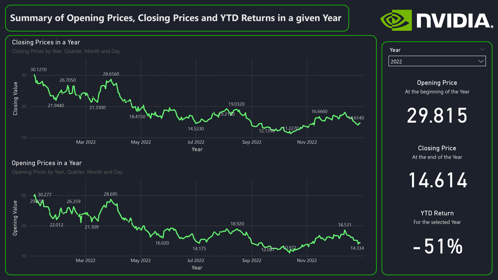
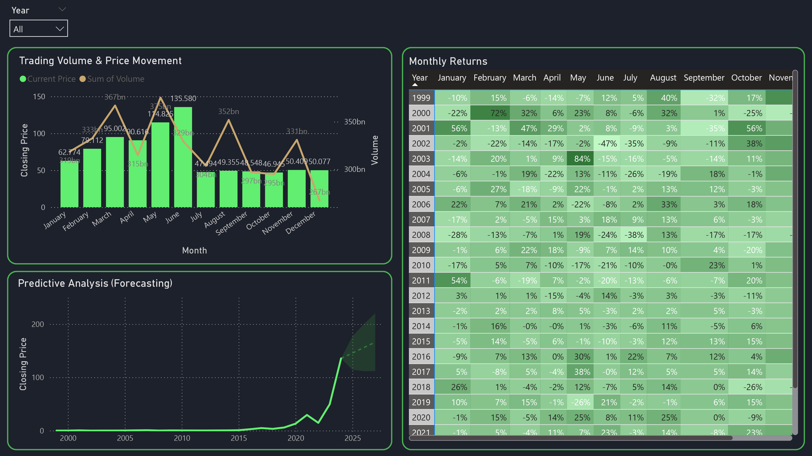

# 📊 NVIDIA Stock Analytics Dashboard | Power BI Project

## 📝 Project Overview
This project provides a comprehensive analysis of NVIDIA’s stock performance from 1999 to June 2024 using Power BI. It explores historical trends, price movements, trading volume, monthly returns, 
and predictive analysis. The project features interactive dashboards for investors to analyze key financial metrics and forecast future stock movements.

---

## 📂 Dataset Description
The dataset includes the following tables and fields:
- Opening Price, Close Price, Adjusted Close Price
- Highest Values, Lowest Values, Traded Volume

📁 **File:** `NVDA.csv`  
📄 **Sample Rows:** 6393 rows

📌 **YTD Return for 2024:** 175%

---

## 🛠 Tools & Technologies Used
- Power BI Desktop
- Power Query
- DAX (Data Analysis Expressions)
- CSV / Excel data sources

---

## 📊 Dashboard Features
- 📉 **Opening Price in a Year**
- 📉 **Closing Price in a Year**
- 📉 **YTD Return**
- 📉 **Trading Volume & Price Movement**
- 📉 **Predictive Analysis**
- 📉 **Monthly Returns**

---

## 📷 Dashboard Preview

---

## 💡 Key Insights
- NVIDIA's trading volume tends to spike during earnings reports, product launches, or major market movements.
- June 2024 had the highest trading volume (~352bn), coinciding with a price peak.
- Investors can identify periods of high volatility and trading activity.

---

## 🚀 Getting Started
1. Download `nvidia2.pbix`
2. Open with [Power BI Desktop](https://powerbi.microsoft.com/en-us/desktop/)
3. Explore visuals and filters for insights

---

## 📬 Connect With Me
👤 **[Vladan Jančić]**  
📧 [vladan.jncc@protonmail.com]  
🔗 [LinkedIn Profile](https://www.linkedin.com/in/vladan-jančić-data/)

---
